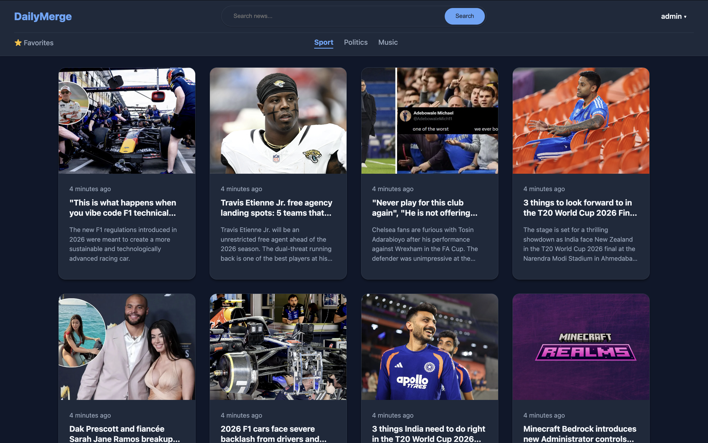
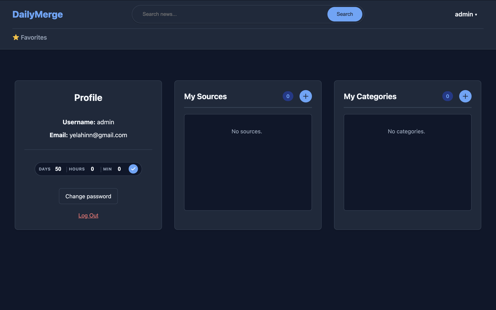
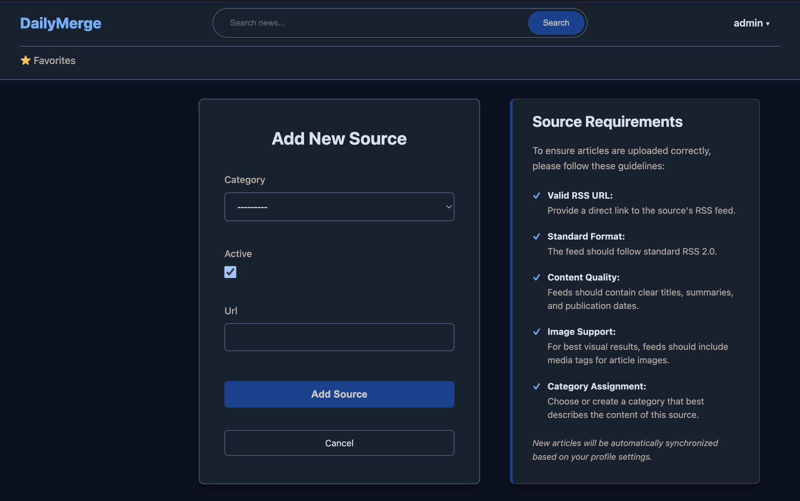

# DailyMerge







**DailyMerge** is a Django-based news aggregator website that collects articles from RSS feeds. The data is normalized, stored in a database, and displayed on the main page while it remains relevant. Outdated articles are automatically removed to keep the news fresh.


## Main Features 

- Aggregates news from RSS feeds
- Scheduled background fetching and automatic removal of outdated articles
- Admin panel for managing sources, categories, and articles
- User registration and authentication
- User profile for managing filters, categories, and sources
- Shared objects optimization between users
- Password management (reset and change password)
- CRUD operations 
- Category-based filtering
- Asynchronous validation of article images

## Installation

1. Clone the repo
```sh
git clone https://github.com/Yelahin/dailymerge.git
```

2. Navigate to the project root (where `manage.py` is located)

```sh
cd dailymerge
```

3. Create .env file and set up variables


```
DJANGO_SECRET=
DJANGO_ALLOWED_HOSTS=127.0.0.1, localhost
POSTGRES_DB=
POSTGRES_USER=
POSTGRES_PASSWORD=
POSTGRES_HOST=postgres
POSTGRES_PORT=5432
EMAIL_HOST_USER=
EMAIL_HOST_PASSWORD=
```

4. Start Docker Compose and create superuser

```sh
docker compose up --build -d
```

```sh
docker exec -it django python manage.py createsuperuser
```

## Built with

Core technologies and libraries used in this project.


- 

- 

- 


- 

- 

- 


- 

<hr>

## License

This project is licensed under the MIT License. See the [LICENSE](LICENSE) file for details.

